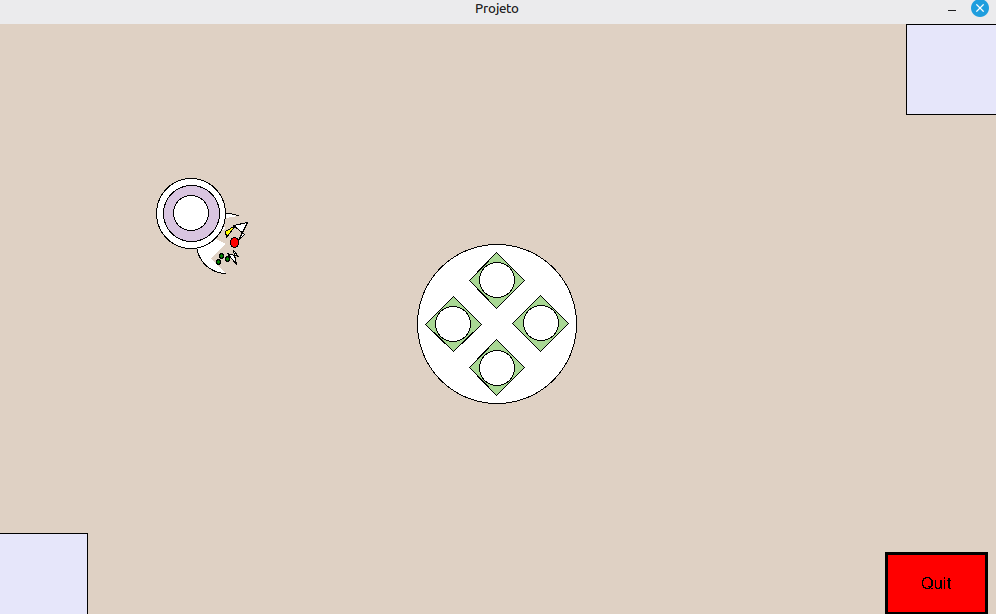
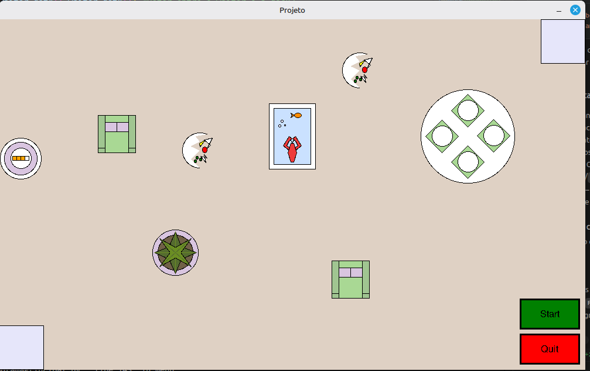
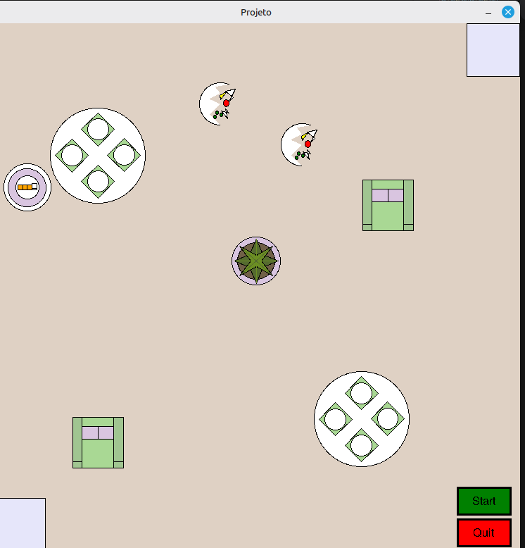

# 🤖 CleaningRobot-FP

Projeto de **Fundamentos de Programação** desenvolvido em Python, que simula um **robô de limpeza autónomo** numa sala 2D com obstáculos. O robô navega pelo espaço, deteta e limpa sujidades, desvia-se de obstáculos e gere a sua bateria regressando às docks de carregamento quando necessário.

---

## 📋 Índice

- [Descrição do Projeto](#descrição-do-projeto)
- [Funcionalidades](#funcionalidades)
- [Estrutura do Projeto](#estrutura-do-projeto)
- [Requisitos](#requisitos)
- [Como Executar](#como-executar)
- [Implementações Disponíveis](#implementações-disponíveis)
- [Ficheiros de Configuração](#ficheiros-de-configuração)
- [Arquitetura e Classes](#arquitetura-e-classes)

---

## 📖 Descrição do Projeto

Este projeto simula o comportamento de um **robô aspirador** que opera numa sala virtual com obstáculos (mesas, cadeiras, aquários e plantas). O robô é capaz de:

- Navegar omnidireccionalmente pela sala
- Detetar e limpar sujidades (representadas como pratos partidos)
- Desviar-se de obstáculos usando hitboxes
- Gerir a bateria e regressar às docks de carregamento quando necessário
- Varrer sistematicamente toda a sala em padrão de serpentina

A interface gráfica é construída com a biblioteca **`graphics.py`** (baseada em Tkinter), onde tudo é animado em tempo real.

---

## ✨ Funcionalidades

| Funcionalidade | Descrição |
|---|---|
| 🎯 Modo interativo | O utilizador clica na janela para definir pontos de sujidade |
| 📂 Modo ficheiro | As sujidades e obstáculos são lidos de ficheiros `.txt` |
| 🔀 Modo aleatório | Os obstáculos são gerados aleatoriamente a cada execução |
| 🔋 Gestão de bateria | O robô vai carregar quando a bateria desce abaixo de 15% |
| 🚧 Desvio de obstáculos | O robô contorna obstáculos sem colidir |
| 🧹 Limpeza sistemática | Varrimento em serpentina cobrindo toda a área da sala |
| 🧽 Animação de limpeza | Movimento quadrado em torno de cada sujidade |
| ⚡ Animação de carregamento | Animação visual da bateria a carregar |

---

## 📁 Estrutura do Projeto

```
CleaningRobot-FP/
│
├── main/
│   ├── ProgramaPrincipal.py   # Programa principal — lógica de todas as implementações
│   ├── Waiter.py              # Classe do robô (movimento, bateria, desenho)
│   ├── Mess.py                # Classe da sujidade (prato partido)
│   ├── Dock.py                # Classe das docks de carregamento
│   ├── Table.py               # Obstáculo: mesa
│   ├── Chair.py               # Obstáculo: cadeira
│   ├── FishTank.py            # Obstáculo: aquário
│   ├── Plant.py               # Obstáculo: planta
│   ├── Menu.py                # Menu principal gráfico
│   ├── Submenu.py             # Submenu para seleção de modo (click/ficheiro)
│   ├── Button.py              # Classe de botão genérico
│   ├── MenuButton.py          # Variante de botão para o menu
│   ├── graphics.py            # Biblioteca gráfica (baseada em Tkinter)
│   ├── Sala.txt               # Configuração da sala e obstáculos (Imp. 3-Ficheiro)
│   └── Limpeza.txt            # Coordenadas das sujidades (Imp. 3-Ficheiro e Aleat.)
│
├── Documentacao_tecnica_.pdf  # Documentação técnica do projeto
├── Manual de utilizador.pdf   # Manual de utilizador
└── ProjFP23.pdf               # Enunciado do projeto
```

---

## ⚙️ Requisitos

- **Python 3.x**
- **Tkinter** (normalmente incluído com o Python)
- Sem dependências externas — a biblioteca `graphics.py` está incluída no projeto

### Verificar se o Tkinter está instalado

```bash
python3 -c "import tkinter; print('Tkinter OK')"
```

Se não estiver disponível, instalar com:

```bash
# Ubuntu/Debian
sudo apt-get install python3-tk

# Fedora
sudo dnf install python3-tkinter
```

---

## ▶️ Como Executar

1. **Navegar para a pasta do projeto:**

```bash
cd CleaningRobot-FP/main
```

2. **Executar o programa principal:**

```bash
python3 ProgramaPrincipal.py
```

3. **O Menu Principal abrirá** com 4 opções de implementações + botão Sair.

> ⚠️ O programa deve ser executado **a partir da pasta `main/`**, pois os ficheiros `Sala.txt` e `Limpeza.txt` são lidos com caminhos relativos.

---

## 🗂️ Implementações Disponíveis

### 1ª Implementação — Robô Omnidirecional Simples

O robô move-se diretamente até ao ponto clicado pelo utilizador, desvia-se de **uma mesa central** e, após limpar, regressa à dock mais próxima.

<p align="center">
  
</p>

**Como usar:**
1. Clicar num ponto válido da sala (fora da mesa e das bordas)
2. O robô dirige-se ao ponto, executa o movimento de limpeza e regressa à dock
3. Pode-se continuar a clicar para definir novos pontos de limpeza
4. Clicar em **Quit** para voltar ao menu

---

### 2ª Implementação — Varrimento Sistemático com Bateria

O robô varre **toda a sala em serpentina** (esquerda-direita, subindo faixas), com **5 obstáculos** fixos (mesa, planta, aquário, cadeira×2) e **gestão de bateria**.

<p align="center">
  
</p>

**Como usar:**
1. Clicar nos pontos de sujidade pretendidos (podem ser vários)
2. Clicar em **Start** para iniciar o varrimento
3. O robô percorre toda a sala e limpa as sujidades ao encontrá-las
4. Quando a bateria fica abaixo de 15%, o robô vai automaticamente à dock mais próxima e carrega
5. Ao terminar o varrimento, volta a aceitar novos pontos de sujidade

---

### 3ª Implementação — Ficheiro (Sala.txt + Limpeza.txt)

Os **obstáculos são lidos do ficheiro `Sala.txt`** e as sujidades podem ser introduzidas por clique do rato ou lidas do ficheiro `Limpeza.txt`. A janela é menor (750×750, coordenadas 0-100).

<p align="center">
  
</p>

**Ao selecionar esta opção, abre um submenu com dois modos:**

| Modo | Descrição |
|---|---|
| **Click** | O utilizador clica para definir os pontos de sujidade, depois clica em Start |
| **File** | As sujidades são carregadas automaticamente do `Limpeza.txt` ao clicar em Start |

---

### 3ª Implementação — Geração Aleatória

Funciona como a 2ª implementação, mas os **5 obstáculos são gerados em posições aleatórias** a cada execução. Inclui um botão **Refresh** para regenerar os obstáculos (apenas quando não há sujidades definidas).

> A disposição dos obstáculos muda a cada execução — a screenshot acima (Imp3) é um exemplo possível.

**Como usar:**
1. (Opcional) Clicar em **Refresh** para gerar novos obstáculos
2. Selecionar o modo **Click** ou **File** no submenu
3. Definir sujidades e clicar em **Start**

---

## 📄 Ficheiros de Configuração

### `Sala.txt` — Configuração da sala (Implementação 3-Ficheiro)

```
Tamanho da janela de simulacao sugerida:
750 750

Localizacao dos objectos:
Docks
Point(5,5)        ← Dock 1 (canto inferior esquerdo)
Point(95,95)      ← Dock 2 (canto superior direito)
Table:Point(70,25)
Chair2:Point(75,65)
Chair1:Point(20,20)
Table2:Point(20,75)
Plant:Point(50,55)
```

### `Limpeza.txt` — Pontos de sujidade (coordenadas)

```
Pontos de maior sujidade:
50-85-900-200     ← formato: x_imp3-y_imp3-x_aleat-y_aleat
75-45-100-300
25-50-600-295
35-15-0-0
```

> Os dois primeiros valores (separados por `-`) são usados na Implementação 3-Ficheiro (coordenadas 0-100), e os dois últimos na Implementação Aleatória (coordenadas 0-1000/0-600).

---

## 🏗️ Arquitetura e Classes

### `Waiter` — O Robô
Composto por 3 círculos concêntricos (visual em camadas). Possui:
- **`move(dx, dy)`** — Move o robô e desconta a bateria
- **`checkbat()`** — Retorna `True` se a bateria ≤ 15%
- **`batteryanimation(charge)`** — Animação visual de carregamento
- **`drawbattery(win)`** / **`undrawbattery()`** — Mostra/oculta indicador de bateria (4 segmentos: verde → laranja → amarelo → vermelho)

### `Mess` — A Sujidade
Representada graficamente como um **prato partido** com comida (círculo branco, fragmentos, ervilhas verdes, comida vermelha e amarela).

### Obstáculos (`Table`, `Chair`, `FishTank`, `Plant`)
Cada obstáculo tem uma **hitbox retangular** (`xmin`, `xmax`, `ymin`, `ymax`) e um método `cont(x, y)` que diz se um ponto está dentro da hitbox. Todos são desenhados graficamente com formas geométricas compostas.

### `Dock` — Estação de Carregamento
Representação visual das bases de carregamento nos cantos da sala. Fornece as coordenadas de centro para a navegação do robô.

### Funções Principais (`ProgramaPrincipal.py`)

| Função | Descrição |
|---|---|
| `vetor(aX,aY,bX,bY)` | Calcula vetor unitário e norma entre dois pontos |
| `invalidlocal(...)` | Valida se um clique está em posição permitida |
| `choosedock(...)` | Escolhe a dock mais próxima do robô |
| `Limpeza(...)` | Executa o movimento quadrado de limpeza em torno da sujidade |
| `gocharge(...)` | Dirige o robô à dock quando a bateria está fraca |
| `searchmess(...)` | Procura sujidades no trajeto atual e limpa-as |
| `aleatpoint(...)` | Gera posições aleatórias para os 5 obstáculos |

---

## 👥 Autores

Projeto desenvolvido no âmbito da UC de **Fundamentos de Programação** — 2022/2023.